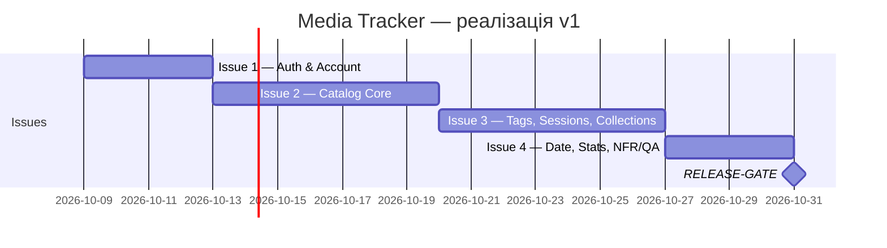

# План реалізації — Media Tracker v1

## Поетапний план

Реалізація розбита на 4 послідовні етапи (Issue 1-4) + фінальну
контрольну точку. Послідовність лінійна: кожен наступний етап
залежить від завершення попереднього, оскільки функціональність
кожного наступного блоку працює поверх даних і сутностей,
створених на попередньому.

1. **Issue 1 — Authentication & Account** (стартовий, без залежностей)
   Реєстрація, вхід/вихід, зміна нікнейму. Базовий блок, без якого
   неможливо тестувати решту (усі дані прив'язані до користувача).

2. **Issue 2 — Catalog Core** (залежить від Issue 1)
   CRUD каталогу, фільтри, пошук, сортування, обкладинки.
   Потребує існуючого акаунта для прив'язки елементів каталогу.

3. **Issue 3 — Tags, Sessions & Collections** (залежить від Issue 2)
   Теги, повторні перегляди, добірки. Уся ця логіка працює з уже
   існуючими елементами каталогу (Issue 2) тому не може випереджати його.

4. **Issue 4 — Date Auto-fill, Statistics & NFR/QA** (залежить від Issue 3)
   Статистика рахує завершені елементи з урахуванням Sessions — логічно останній функціональний блок. NFR/QA
   перевіряються по всій системі в зборі.

5. **RELEASE-GATE** (залежить від Issue 4)
   Фінальна людська перевірка перед релізом v1.

## Діаграма Ганта (п.10)

## Критичний шлях

Оскільки залежності повністю лінійні (кожна issue блокує наступну,
паралельної роботи немає), **критичний шлях дорівнює всій
послідовності**: Issue 1 → Issue 2 → Issue 3 → Issue 4 → RELEASE-GATE.
Затримка будь-якої з чотирьох issues безпосередньо зсуває дату
завершення всього проєкту — окремого "некритичного" тікета в цьому
плані немає, бо всі важливі.

## Оцінка людського часу (окремо від агента)

Технічна реалізація (Test + Feature) виконується агентом швидко,
але пропускну здатність проєкту обмежує саме людська частина:

| Issue | Validation людиною (перевірка AC вручну) |
|---|---|
| Issue 1 | ~30 хв (5 AC-пунктів) |
| Issue 2 | ~40 хв (11 AC-пунктів, найбільший блок) |
| Issue 3 | ~30 хв (11 AC-пунктів + 3 BDD-сценарії вручну) |
| Issue 4 | ~30 хв (9 AC-пунктів + NFR-перевірки) |
| RELEASE-GATE | ~20 хв (наскрізний acceptance-сценарій) |

Навіть якщо агент реалізує код за лічені хвилини, **Validation і
Gate-рішення виконує виключно людина** — це і є реальне "вузьке
місце" пропускної здатності проєкту, а не швидкість генерації коду.